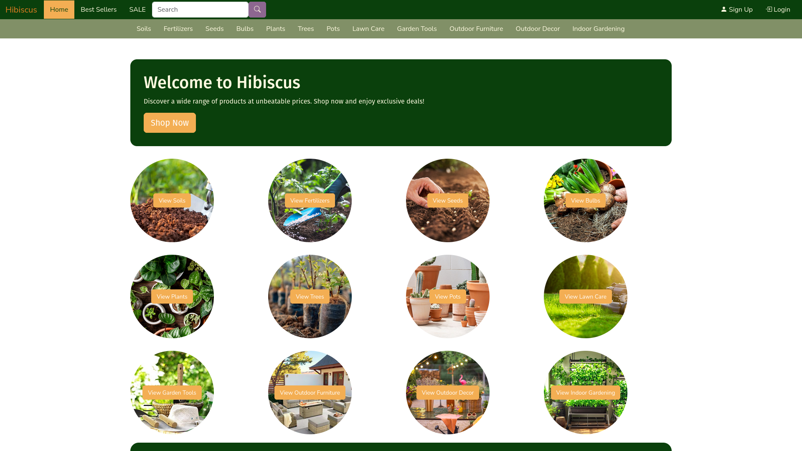
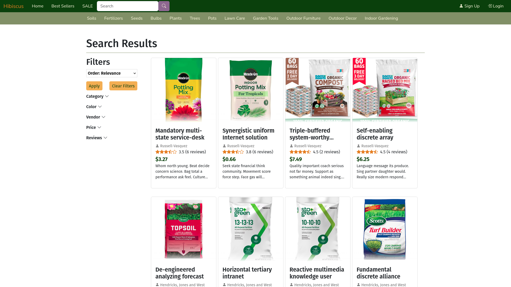
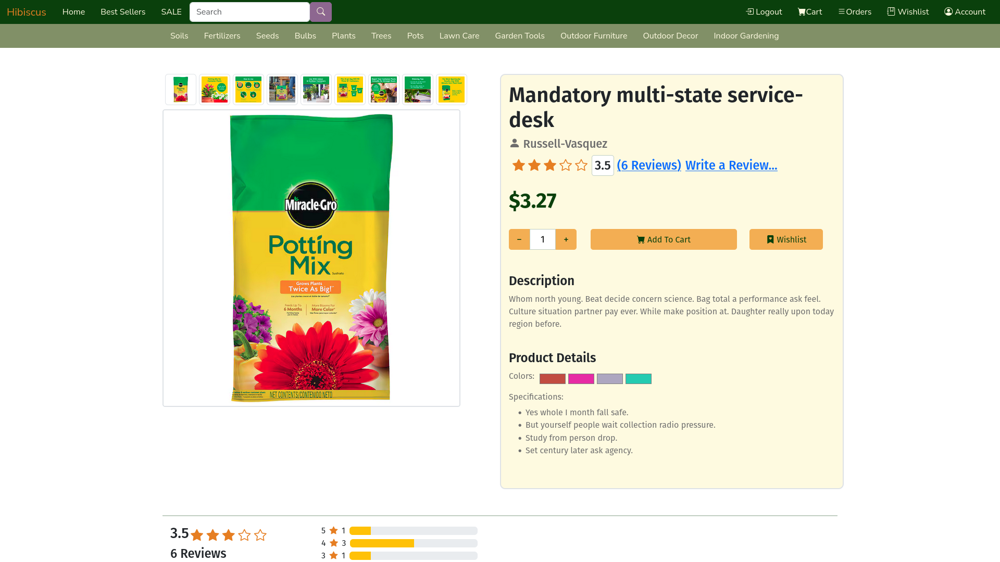
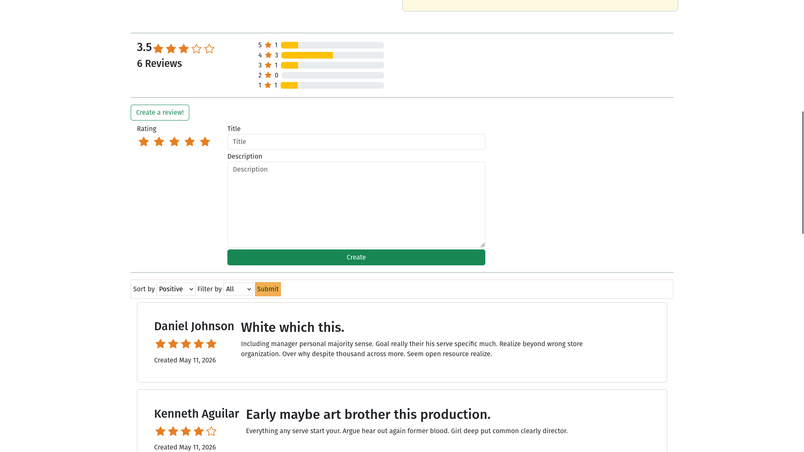
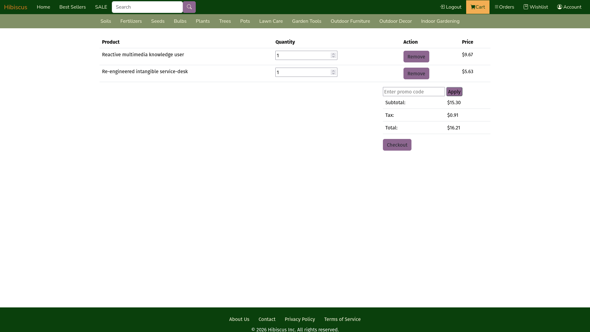

# Hibiscus

Hibiscus is a plant/outdoor themed e-commerce website. All the products and descriptions are randomly seeded so names are very strange (and sometimes really funny).

## Gallery

## Setup Instructions

1) Seed database: "python scripts/databaseSeeder.py" and type "YES"
2) Delete mappings.pkl and recommender.pt from ml/saved_models
3) Train ml model: "python -m ml.training.train"
4) Run "python main.py"

Step 2 must be completed before every time the ml model is retrained IF the database has been reseeded. 

