# Hibiscus

Hibiscus is a garden center themed e-commerce website. This serves as an undergraduate Capstone project for Spring 2026. 

Hibiscus has three types of sample users with distinct permissions: customer, vendor, admin, or any combination of the three. Sample data is generated using a faker library, leading to some amusing names. Data variables include 100 users, 50+ products, carts and wishlists for each user, previous orders, and product reviews. 

A blended recommendation system is used to promote "related" products, "customers also bought" products, and "recommended for you" products. "Recommended for you" products are determined using a machine learning model trained using a Bayesian Personalized Ranking system. After training, the it generates a personalized total ranking for each user derived from implicit feedback (clicks & purchases) and review ratings, based on the idea that a user prefers any item they have interacted with over items they have not. 

## Gallery

Home Page (no user logged in)
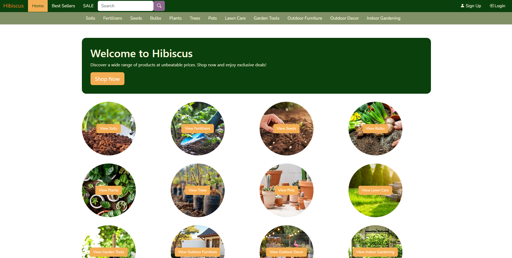
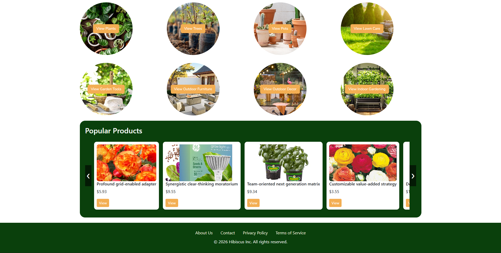

Login Page
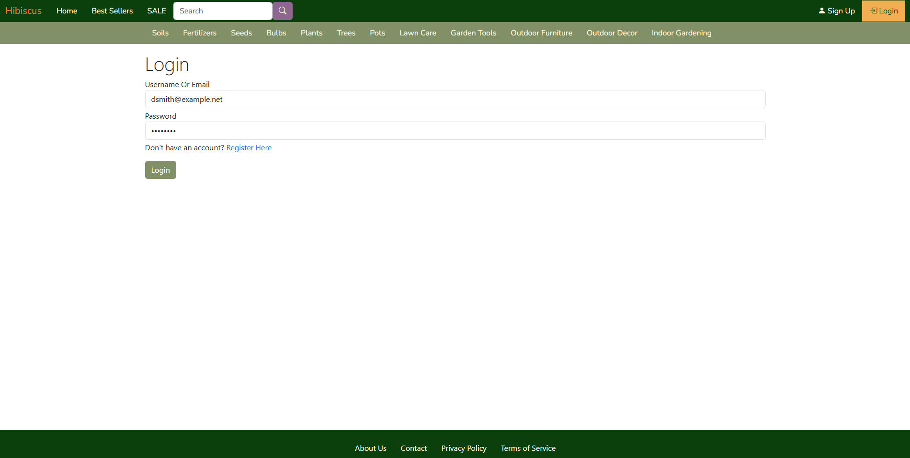

Product Page
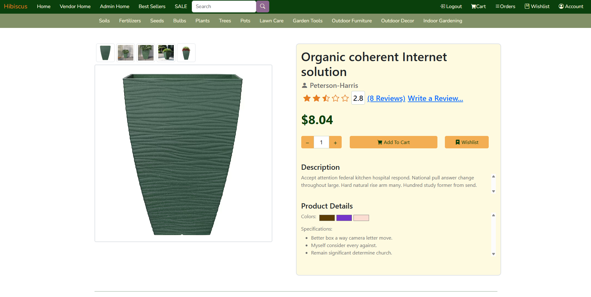

Scroll further to see product reviews!
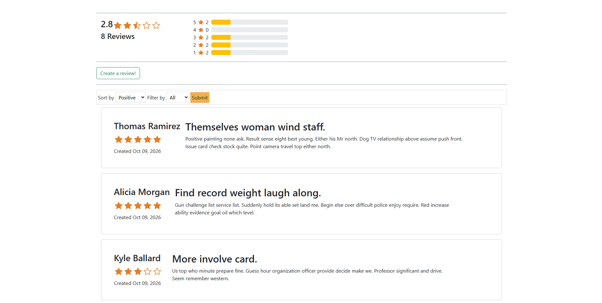

Under reviews you can find related products and also bought-together items.
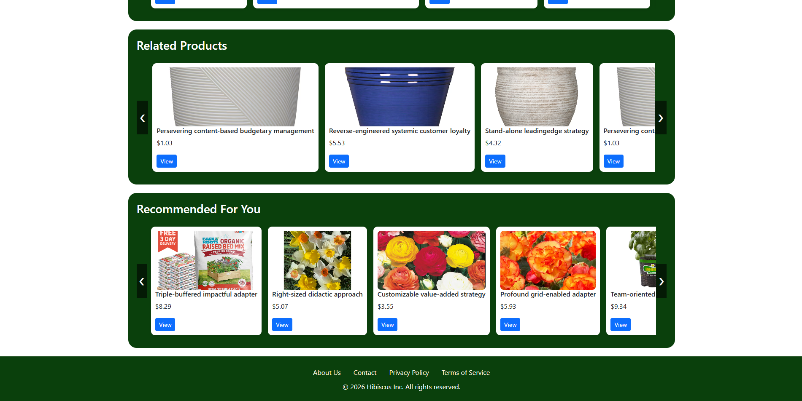

If a user is logged in, you can also see personalized recommendations.
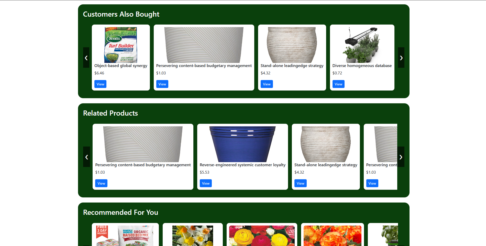

Cart Page (Requires logged in user)
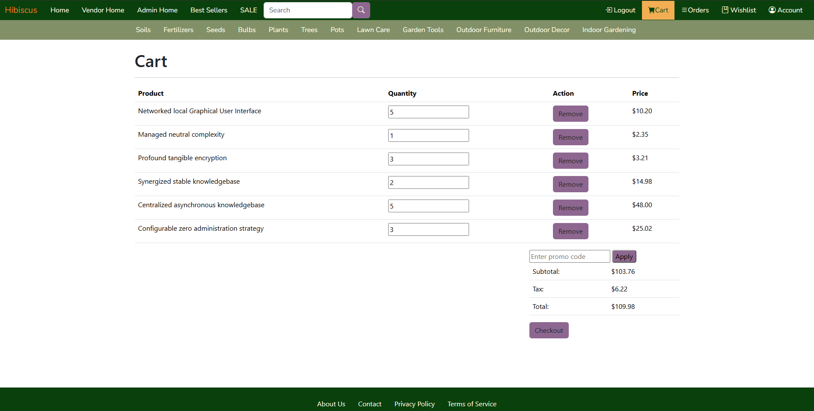

Cart with Promotion (Requires entering promo code)
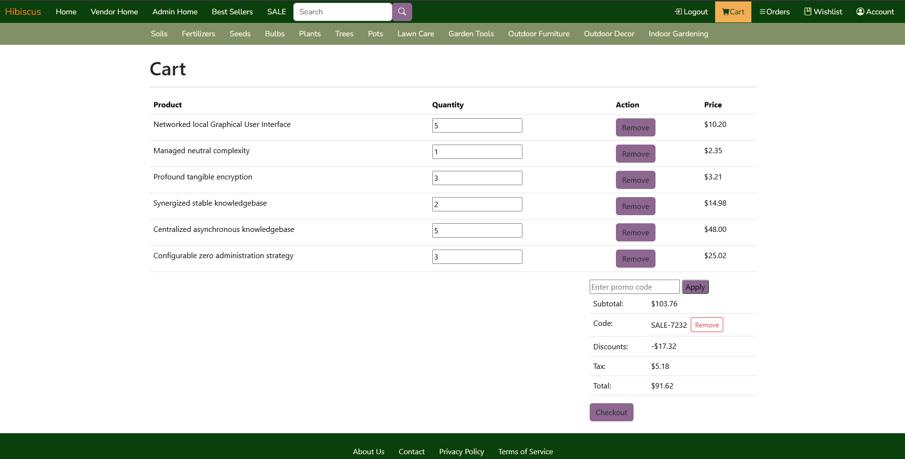

Wishlist Page (Rquires logged in user)
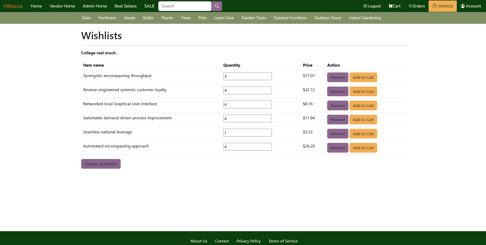

Account Page (Requires logged in user. Shown user has types="vendor", "admin", "customer")
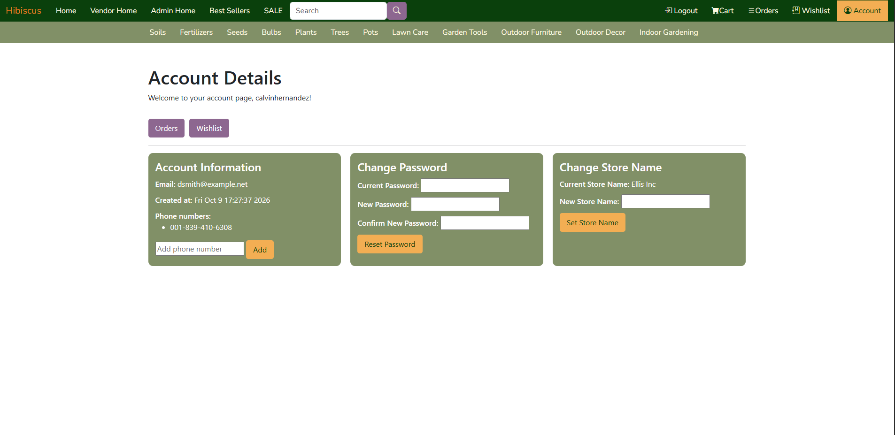
Note: "Account Information" and "Change Password" sections are available for all user types. "Change Store Name" is only available for users with the "vendor" type.

Orders Page (Requires logged in "customer" type user)
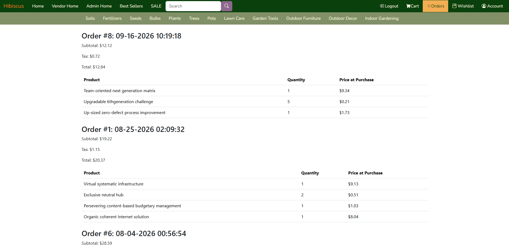

Vendor Home Page (Requires logged in "vendor" type user)
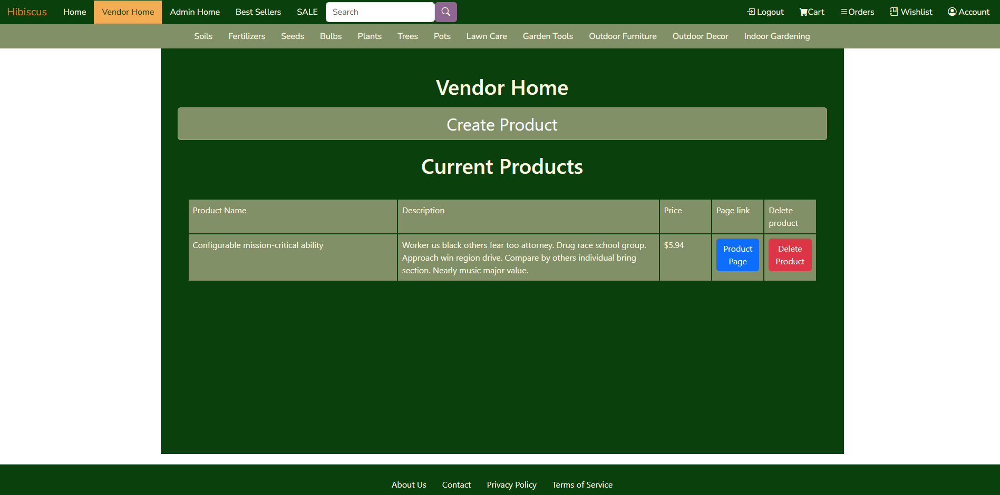

Admin Home Page (Requires logged in "admin" type user)
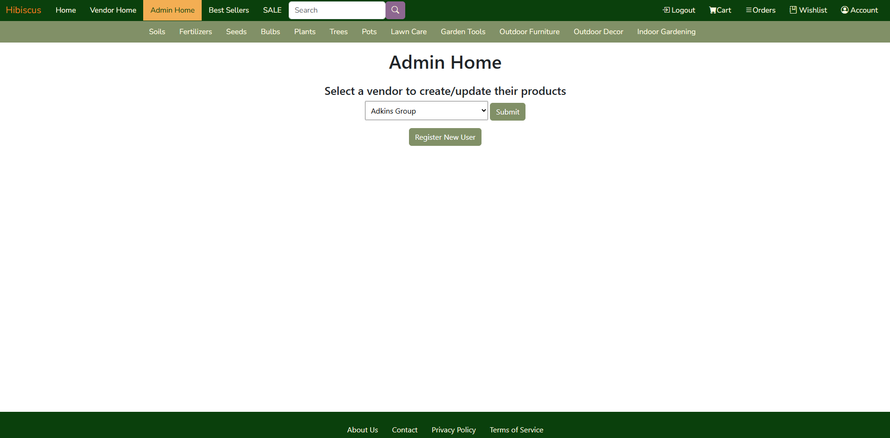

## Setup Instructions

1) Download the zip folder and extract its contents. 
2) Open a terminal in the main folder "Capstone". 
3) In the terminal, run: "python scripts/databaseSeeder.py" and type "YES" to seed the database.
4) Delete mappings.pkl and recommender.pt from ml/saved_models if they exist.
5) In the terminal, run: "python -m ml.training.train" to train the ml model.
6) In the terminal, run: "python main.py" to launch the application.
7) Visit http://127.0.0.1:5000/home

(Note: Step 4 must be completed before every time the ml model is retrained IF the database has been reseeded.)